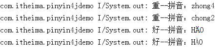

# 开源项目pinyin4j使用简介
pinyin4j这个java库方便实现将汉字转换拼音

开源地址：[https://github.com/open-android/pinyin4j](https://github.com/open-android/pinyin4j "开源项目地址")

# 使用效果

（重）--（chong2/zhong4）
（好）--（HĂO/HÀO）

## 使用步骤

### 1. 在project的build.gradle添加如下代码(如下图)

	allprojects {
	    repositories {
	        ...
	        maven { url "https://jitpack.io" }
	    }
	}

### 2. 在Module的build.gradle添加依赖
	
	compile 'com.github.open-android:pinyin4j:2.5.0'

### 3.演示步骤

* 将演示代码复制到Activity的onCreate方法中

        //-------------------默认格式转换-----------------------------
        String[] pyStrs = PinyinHelper.toHanyuPinyinStringArray('重');

        for (String s : pyStrs) {
            System.out.println(s);
        }

        //-------------------指定格式转换----------------------------
        HanyuPinyinOutputFormat format = new HanyuPinyinOutputFormat();

        // UPPERCASE：大写  (ZHONG)
        // LOWERCASE：小写  (zhong)
        format.setCaseType(HanyuPinyinCaseType.UPPERCASE);//输出大写

        // WITHOUT_TONE：无音标  (zhong)
        // WITH_TONE_NUMBER：1-4数字表示音标  (zhong4)
        // WITH_TONE_MARK：直接用音标符（必须WITH_U_UNICODE否则异常）  (zhòng)
        format.setToneType(HanyuPinyinToneType.WITH_TONE_MARK);

        // WITH_V：用v表示ü  (nv)
        // WITH_U_AND_COLON：用"u:"表示ü  (nu:)
        // WITH_U_UNICODE：直接用ü (nü)
        format.setVCharType(HanyuPinyinVCharType.WITH_U_UNICODE);

        String[] hao = PinyinHelper.toHanyuPinyinStringArray('好', format);

        for (String s : hao) {
            System.out.println(s);
        }
   

> 注意捕获BadHanyuPinyinOutputFormatCombination异常
 

* 更多干货请下载app

* 欢迎关注微信公众号

